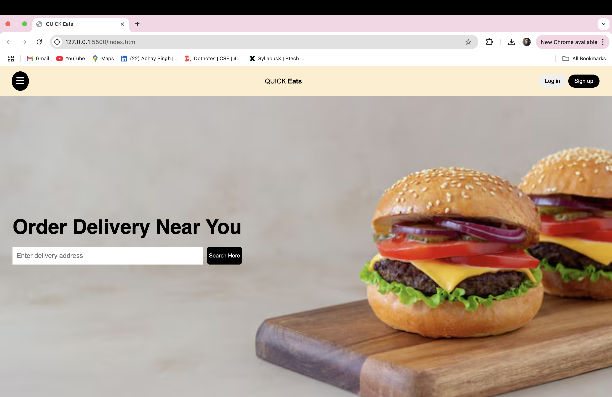

# 🍔 Quick Eats - Responsive Food Delivery Web App (Frontend UI)

**Quick Eats** is a sleek and modern homepage UI for a food delivery web application. Built using only **HTML** and **CSS**, it features a fully responsive design that works seamlessly across devices.

---

## 📸 Demo

 

## 🚀 Features

- 🖥️ Fully responsive layout (mobile, tablet, desktop)
- 🍕 Modern, clean user interface
- 📱 Mobile-first design approach
- 🌐 Built with HTML5 and CSS3 only
- 🔥 Interactive buttons and hover effects

## 📁 Project Structure